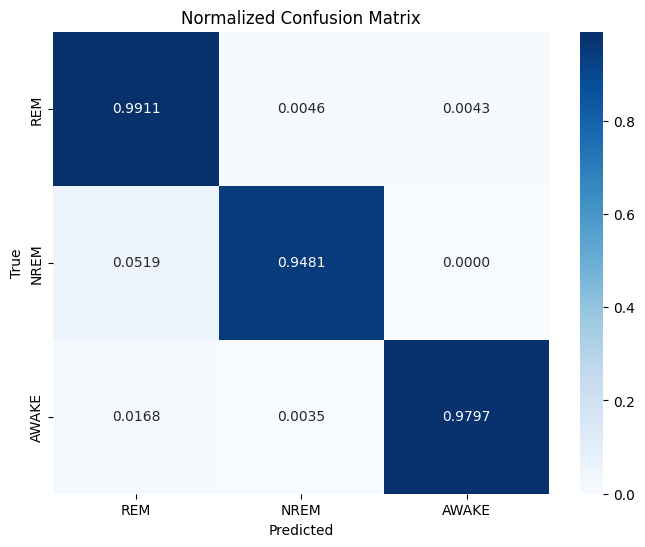

# 🧠 EEGNet - Sleep State Classification from EEG Data

[](https://pytorch.org/)
[](https://www.python.org/)
[](LICENSE)
[](https://doi.org/10.5281/zenodo.XXXXXX)

A deep learning model for classifying sleep states (REM, NREM, AWAKE) from EEG recordings using a custom EEGNet architecture implemented in PyTorch.

## 📋 Overview

This project implements a specialized EEGNet architecture optimized for analyzing and classifying sleep states from electroencephalogram (EEG) recordings in mice. The model is based on the EEGNet architecture introduced by Lawhern et al. (2018) [1], adapted specifically for sleep state classification. The architecture utilizes a three-layer convolutional neural network consisting of:

1. **Spatial convolution** - captures spatial patterns across EEG channels
2. **Depthwise convolution** - captures temporal patterns within each spatial filter
3. **Separable convolution** - combines information across filters

Our dataset comprises 10-second EEG recordings from the AC (anterior cortex) and OB (olfactory bulb) regions, with a shape of `(n, 1280, 2)`, where:
- `n` represents the number of samples
- `1280` corresponds to the sampling rate (128 Hz) multiplied by the recording duration (10 seconds)
- `2` signifies the two EEG channels (AC and OB)

The model was trained using data from 9 mice (M296, M297, M407, M484, M591, M612, M613, M633, M672) across 62 partially labeled recording sessions. This diverse dataset ensured robust learning across individual variations and different recording conditions.

## ✨ Features

* **Custom EEGNet Architecture:** Implements an efficient and effective EEGNet model tailored for sleep state classification
* **High F1 Score:** Achieves >96% macro F1 score in distinguishing between REM, NREM, and AWAKE states
* **Z-score Normalization:** Implements channel-wise z-score normalization for robust feature extraction
* **GPU-Accelerated:** Leverages CUDA for faster training and inference
* **Comprehensive Evaluation:** Includes detailed performance metrics and confusion matrices
* **Inference Pipeline:** Ready-to-use inference code for sleep state prediction on new EEG recordings

## 🔬 Technical Details

### Model Architecture

The EEGNet model is based on the architecture described by Lawhern et al. [1] but adapted for sleep state classification. It employs a specialized architecture designed for EEG signal processing:

```
Input (10s EEG, 2 channels) → Spatial Conv → BatchNorm → ELU → MaxPool → Dropout
    → Depthwise Conv → BatchNorm → ELU → MaxPool → Dropout
    → Separable Conv → BatchNorm → ELU → MaxPool → Dropout
    → Flatten → Dense → Softmax → Output (3 classes)
```

### Preprocessing

- **Z-score Normalization**: Each channel is normalized independently
- **Segmentation**: Continuous EEG recordings are segmented into 10-second windows
- **Data Split**: 10-fold cross-validation where each fold consists of a separate labeled recording session

### Hyperparameter Optimization

We used Optuna for structured hyperparameter optimization:

- **Search Space**: 500 different parameter combinations were explored
- **Validation Approach**: 95% of data was used for training, with 5% held out for validation
- **Early Stopping**: Training was stopped if validation loss did not improve for 30 consecutive epochs
- **Optimization Metric**: Average F1 score across all classes was used as the target metric to maximize
- **Visualization**: Results are available in `optuna_optimization_history.html`

#### Optimal Model Parameters

The following parameters were determined to be optimal after comprehensive grid search:

| Parameter | Value |
|-----------|-------|
| F1 (Spatial filters) | 32 |
| F2 (Separable conv filters) | 8 |
| D (Depth multiplier) | 2 |
| Dropout rate | 0.1604 |
| Learning rate | 0.0007498 |
| Batch size | 32 |
| Weight decay | 0.0002142 |

### Model Evaluation

After determining the optimal hyperparameters through Optuna, we evaluated the model using a 10-fold cross-validation methodology. Each fold corresponds to a separate labeled recording session. For each iteration, we held out one complete session as the test set while training on the remaining nine sessions using the optimal hyperparameters. This approach ensures that the model is evaluated on completely independent data, which better reflects real-world performance than random splitting of segments from the same recording sessions.

## 📊 Results

Our model demonstrates exceptional performance in classifying sleep states from 10-second EEG segments. We evaluated the model using 10-fold cross-validation with the following results:



*Figure 1: Normalized confusion matrix showing high classification accuracy across all three sleep states (REM, NREM, AWAKE). The diagonal elements show the proportion of correctly classified samples for each class, while off-diagonal elements represent misclassifications.*

### Cross-Validation Performance

| Fold   | Global F1 Score | MCC Score |
|--------|----------------|-----------|
| Fold 1 | 0.9740         | 0.9546    |
| Fold 2 | 0.9911         | 0.9815    |
| Fold 3 | 0.9880         | 0.9723    |
| Fold 4 | 0.9754         | 0.9193    |
| Fold 5 | 0.9689         | 0.9312    |
| Fold 6 | 0.9764         | 0.9477    |
| Fold 7 | 0.9924         | 0.9829    |
| Fold 8 | 0.9962         | 0.9929    |
| Fold 9 | 0.9792         | 0.9503    |
| Fold 10| 0.9952         | 0.9894    |
| **Mean** | **0.9837**   | **0.9622** |

The Matthews Correlation Coefficient (MCC) is a measure of the quality of classifications that works well for multiclass problems. It takes into account all elements of the confusion matrix and produces high scores only when the model performs well on all classes. MCC ranges from -1 to +1, with +1 representing perfect prediction, 0 representing random prediction, and -1 representing complete disagreement between predictions and actual values. Our high MCC scores (mean: 0.9622) demonstrate that our model achieves excellent performance across all three sleep states.

### Class-wise Performance (F1 Scores)

| Fold   | REM    | NREM   | AWAKE   |
|--------|--------|--------|---------|
| Fold 1 | 0.9769 | 1.0000 | 0.9641  |
| Fold 2 | 0.9929 | 0.9412 | 0.9904  |
| Fold 3 | 0.9915 | 0.9333 | 0.9957  |
| Fold 4 | 0.9872 | 0.9524 | 0.9136  |
| Fold 5 | 0.9793 | 0.9130 | 0.9516  |
| Fold 6 | 0.9878 | 0.8889 | 0.9610  |
| Fold 7 | 0.9944 | 0.9474 | 1.0000  |
| Fold 8 | 0.9956 | 0.9818 | 0.9981  |
| Fold 9 | 0.9866 | 0.9074 | 0.9937  |
| Fold 10| 0.9919 | 0.9500 | 0.9982  |
| **Mean** | **0.9884** | **0.9415** | **0.9766** |

## 📁 Repository Structure

```
EEGNET/
├── eegnet.py                          # EEGNet model architecture implementation
├── utils.py                           # Utility functions including z_score_normalize
├── best_model_10s.pth                 # Pre-trained model weights for 10s EEG segments
├── 10-folds.ipynb                     # 10-fold cross-validation implementation
├── train.ipynb                        # Training pipeline
├── evaluate.ipynb                     # Model evaluation
├── predict.ipynb                      # Inference example
├── grid_search.ipynb                  # Hyperparameter optimization
├── focus_session_predictions/         # Predictions on focus session data
├── focus_session_probabilities/       # Prediction probabilities for focus sessions
├── kfolds_results/                    # Detailed results from cross-validation
├── hyperparameter_results_optuna.csv  # Results from hyperparameter optimization
└── optuna_optimization_history.html   # Visualization of optimization process
```

## 🚀 Getting Started

### Prerequisites

- Python 3.7+
- CUDA 12.4+ (for GPU acceleration)

### Requirements

```
torch==2.5.1+cu124
scikit-learn
numpy
pandas
optuna
```

### Installation

1. Clone the repository:
   ```bash
   git clone https://gitlab.dzne.de/glab/EEEGNET
   cd EEGNET
   ```

2. Install dependencies:
   ```bash
   pip install -r requirements.txt
   ```

## 💻 Usage

### Training

To train the model on 10-second EEG data:

1. Update the `data_dir` variable in `train.ipynb` to point to your data directory
2. Run the notebook:
   ```bash
   jupyter notebook train.ipynb
   ```

### Cross-Validation

To replicate the 10-fold cross-validation results:

```bash
jupyter notebook 10-folds.ipynb
```

### Hyperparameter Optimization

To perform hyperparameter optimization using Optuna:

```bash
jupyter notebook grid_search.ipynb
```

### Inference

For inference on new EEG recordings, use the `predict.ipynb` notebook or implement the following code:

```python
import torch
import numpy as np
from eegnet import EEGNet
from utils import z_score_normalize

# Function to load the model
def load_model(model, checkpoint_path):
    model.load_state_dict(torch.load(checkpoint_path))
    model.eval()
    return model

# Set device
device = torch.device("cuda" if torch.cuda.is_available() else "cpu")

# Initialize model with optimal parameters
model = EEGNet(F1=32, F2=8, D=2, dropout_rate=0.1604465584506531, num_classes=3).to(device)

# Load the saved model weights
model = load_model(model, 'best_model_10s.pth')

# Preprocess data (shape: [n_samples, 1280, 2])
eeg = load_your_eeg_data()  # Replace with your data loading function
eeg = eeg[:, :, :2]  # Keep only the first two channels

# Apply z-score normalization per channel
for channel in range(eeg.shape[2]):
    eeg[:, :, channel] = z_score_normalize(eeg[:, :, channel])

# Convert to tensor
eeg_data = torch.tensor(eeg, dtype=torch.float32).to(device)

# Predict
with torch.no_grad():
    outputs = model(eeg_data)
    probs = torch.nn.functional.softmax(outputs, dim=1)
    _, predicted = torch.max(outputs, 1)

# Map indices to class names
classes = ["AWAKE", "NREM", "REM"]
predictions = [classes[idx] for idx in predicted.cpu().numpy()]
```

## 📝 Citing

If you use this code or model in your research, please cite our work and the original EEGNet paper:

```
@software{eegnet_sleep_classification,
  author = {Your Name},
  title = {EEGNet - Sleep State Classification from EEG Data},
  year = {2025},
  publisher = {GitHub},
  url = {https://gitlab.dzne.de/glab/EEEGNET}
}

@article{lawhern2018eegnet,
  title={EEGNet: A Compact Convolutional Network for EEG-based Brain-Computer Interfaces},
  author={Lawhern, Vernon J and Solon, Amelia J and Waytowich, Nicholas R and Gordon, Stephen M and Hung, Chou P and Lance, Brent J},
  journal={Journal of Neural Engineering},
  volume={15},
  number={5},
  pages={056013},
  year={2018},
  publisher={IOP Publishing},
  doi={10.1088/1741-2552/aace8c}
}
```

## Acknowledgments

This research was made possible thanks to the facilities and support provided by the German Center for Neurodegenerative Diseases (DZNE) in Germany. We gratefully acknowledge their resources and infrastructure that enabled the collection and analysis of the EEG data used in this study.

## References

[1] Lawhern, V.J., Solon, A.J., Waytowich, N.R., Gordon, S.M., Hung, C.P., & Lance, B.J. (2018). EEGNet: A Compact Convolutional Network for EEG-based Brain-Computer Interfaces. Journal of Neural Engineering, 15(5), 056013. https://arxiv.org/abs/1611.08024

## 📄 License

This project is licensed under the MIT License - see the [LICENSE](LICENSE) file for details.

## 🤝 Contributing

Contributions are welcome! Please feel free to submit a Pull Request.

1. Fork the repository
2. Create your feature branch (`git checkout -b feature/amazing-feature`)
3. Commit your changes (`git commit -m 'Add some amazing feature'`)
4. Push to the branch (`git push origin feature/amazing-feature`)
5. Open a Pull Request

## 👥 Contributors
- Amine Bahlouli

## 📧 Contact

Amine Bahlouli - amine.bahlouli@dzne.de


